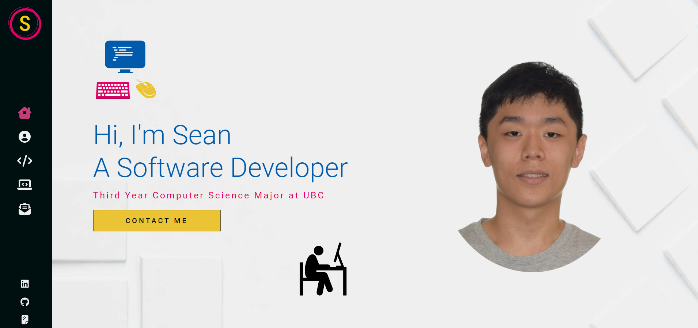
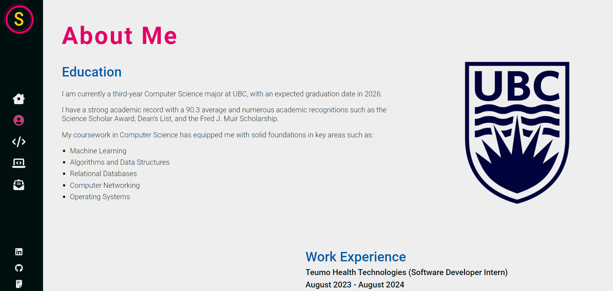
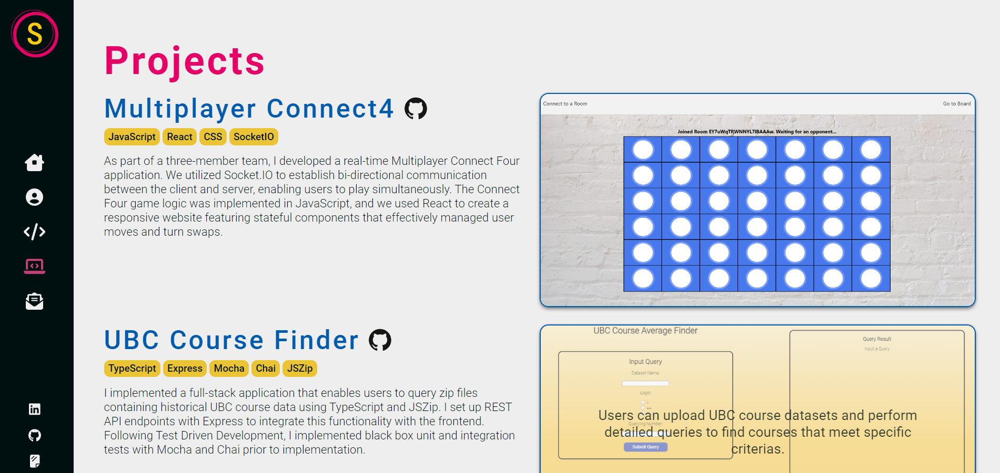

# Personal Portfolio Website

Welcome to my personal portfolio website repository! This application showcases my work, projects, and skills.

You can view my website here: [Portfolio Website Link](https://noh-sean.netlify.app/)

## Features

- Homepage: An introduction with a brief bio and navigation.
- About: A detailed view of my education, experience, and goals.
- Skills: A visual representation of my technical skills.
- Projects: A section showcasing my projects with descriptions and links.
- Contact: A contact form that allows visitors to send me messages directly.

## Used Technologies

- React
- Sass
- React Router
- EmailJS
- LoadersJS.
- Animate.css

## Screenshots

Here are some screenshots of the portfolio website:

## Contact

Feel free to reach out to me via email or through the contact form on the website.

- Email: seannoh1654@yahoo.ca
- [LinkedIn](https://www.linkedin.com/in/sean-noh-310b3123a/)
